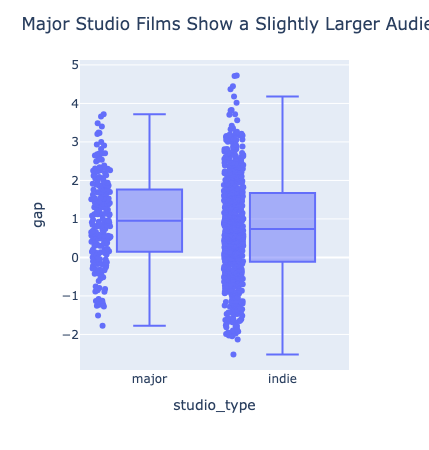
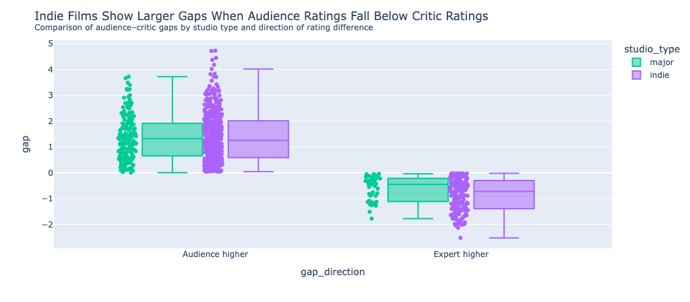
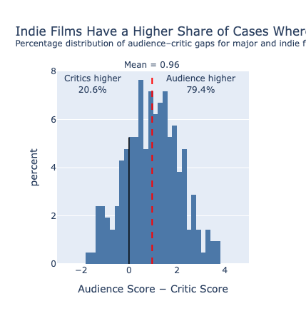
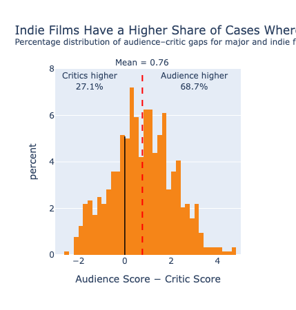
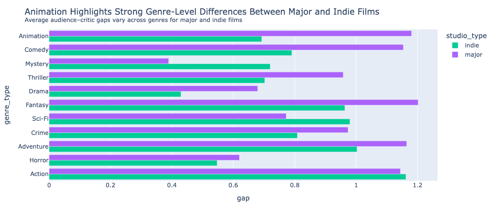
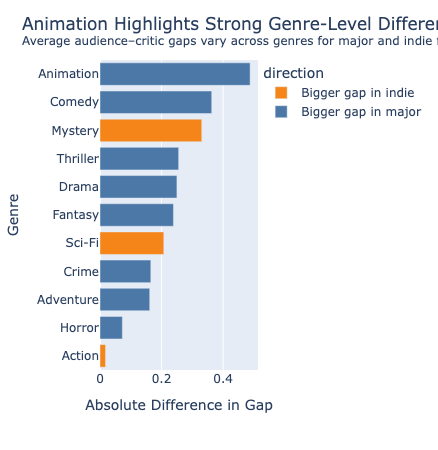

# Do Major Film Studios Benefit from a "Halo Effect"?

A film is evaluated long before the final scene ends.

Before audiences form their own opinions, they may already recognise the
studio behind a movie. Major studios carry decades of reputation,
marketing influence, and audience expectations.

This project examines whether that reputation is reflected in the gap
between **audience ratings** and **professional critic ratings**.

Rather than deciding whether a film is objectively good or bad, this
analysis focuses on whether different groups evaluate films differently.

---

# Research Question

> **Do major studio films show larger audience–critic rating gaps than
> non-major studio films?**

Audience ratings were collected from **TMDB**, while professional critic
ratings were collected from **OMDb**.

Throughout this project:

> **Audience–Critic Gap = Audience Score − Critic Score**

A positive gap means audiences rated a film higher than critics.

A negative gap means critics rated a film higher than audiences.

---

# Findings

## Finding 1

## Major and non-major films show similar overall audience–critic gaps

The overall difference between major and non-major studio films is
relatively modest.

However, separating the direction of disagreement reveals a clearer
pattern: the difference is not driven equally by all films.

<strong>Key finding.</strong>

Overall gaps appear similar, but the direction of disagreement provides
additional insight into how audiences and critics differ.

<figure>

<figcaption>
Overall audience–critic gap by studio type.
</figcaption>

</figure>

---

## Finding 2

## Differences are mainly associated with cases where critics rate films higher than audiences

When audiences rate films higher than critics, major and non-major films
show broadly similar patterns.

The stronger difference appears when critics rate films more positively
than audiences.

<strong>Key finding.</strong>

The observed studio difference is mainly related to negative
audience–critic gaps.

<figure>

<figcaption>
Audience–critic disagreement separated by direction.
</figcaption>

</figure>

---

## Finding 3

## Non-major films contain wider disagreement distributions

The distribution of audience–critic gaps differs between major and
non-major films.

Non-major films contain a larger proportion of cases where critics rate
films more positively than audiences, together with more observations at
the extreme ends of the distribution.

<strong>Key finding.</strong>

Non-major films show greater variation in audience–critic disagreement.

<h3>Major Studio Films</h3>

<figure>

<figcaption>
Distribution of audience–critic gaps for major studio films.
</figcaption>

</figure>

<h3>Non-major Studio Films</h3>

<figure>

<figcaption>
Distribution of audience–critic gaps for non-major studio films.
</figcaption>

</figure>
---

## Finding 4

## The relationship between studio type and audience–critic disagreement varies by genre

Studio affiliation does not create the same pattern across every genre.

Some genres show very similar audience–critic gaps between major and
non-major films, while others display larger differences.

<strong>Key finding.</strong>

Genre appears to influence the relationship between studio type and
audience–critic disagreement.

<figure>

<figcaption>
Average audience–critic gaps across genres.
</figcaption>

</figure>

---

## Finding 5

## Animation shows one of the largest differences between major and non-major films

Genre-level comparisons reveal that some categories behave differently
from the overall pattern.

Animation shows one of the largest differences between major and
non-major films, while Mystery shows the largest difference in the
opposite direction.

<strong>Key finding.</strong>

The effect of studio type is not consistent across genres.

<figure>

<figcaption>
Difference in average audience–critic gaps between major and non-major
films.
</figcaption>

</figure>

---

## Finding 6

## Studio type alone does not explain audience–critic disagreement

The findings suggest that major studio affiliation is associated with
some differences in audience–critic disagreement.

However, the relationship is relatively modest and changes across
genres.

Instead of a simple major versus non-major explanation, disagreement
between audiences and critics likely reflects multiple factors,
including genre and film-specific characteristics.

<strong>Key finding.</strong>

Studio type provides part of the explanation, but not the complete
picture.

---

# What does this mean?

This analysis provides **some evidence** that studio affiliation is
associated with audience–critic rating gaps.

However, the effect is not large or consistent across all genres.

The results suggest that audience–critic disagreement is influenced by
multiple factors rather than a single studio-level effect.

A studio name may shape expectations, but it does not determine how a
film will ultimately be evaluated.

---

# Measuring the Data

## Data sources

Two APIs were combined in this project.

**TMDB** provided:

- audience ratings
- genres
- production companies
- movie metadata

**OMDb** provided:

- professional critic ratings through Metascore

---

## Data preparation

The datasets were merged using **IMDb IDs**.

After merging, additional variables were created:

- audience score
- critic score
- audience–critic gap
- genre classifications

The main measurement used throughout the project was:

> Audience–Critic Gap = Audience Score − Critic Score

---

## Studio classification

Films were separated into two groups:

- major studio films
- non-major studio films

Major studios were identified using the selected production company
classification.

The remaining films were treated as non-major productions.

---

# Limitations

Several limitations should be considered when interpreting these
findings.

- Metascore is treated as a professional reference rather than an
objective measure of film quality.

- The major/non-major classification simplifies a complex production
landscape.

- Some genres contain relatively small sample sizes.

- Minor inconsistencies exist between TMDB and OMDb release years.

---

# Future Directions

Future research could extend this analysis by:

- expanding studio classifications using more comprehensive industry
databases;

- incorporating additional explanatory variables such as marketing
expenditure or franchise status;

- analysing a larger collection of films across multiple rating
platforms.

---

# Project Summary

This project investigated whether major studio films experience larger
audience–critic rating gaps than non-major films.

The findings suggest that:

1. overall differences between studio groups are relatively modest;

2. differences become clearer when the direction of disagreement is
considered;

3. genre plays an important role in shaping audience–critic gaps.

The results do not suggest a simple "major studio advantage".

Instead, they highlight a more complex relationship between studio
identity, genre, audiences, and critics.